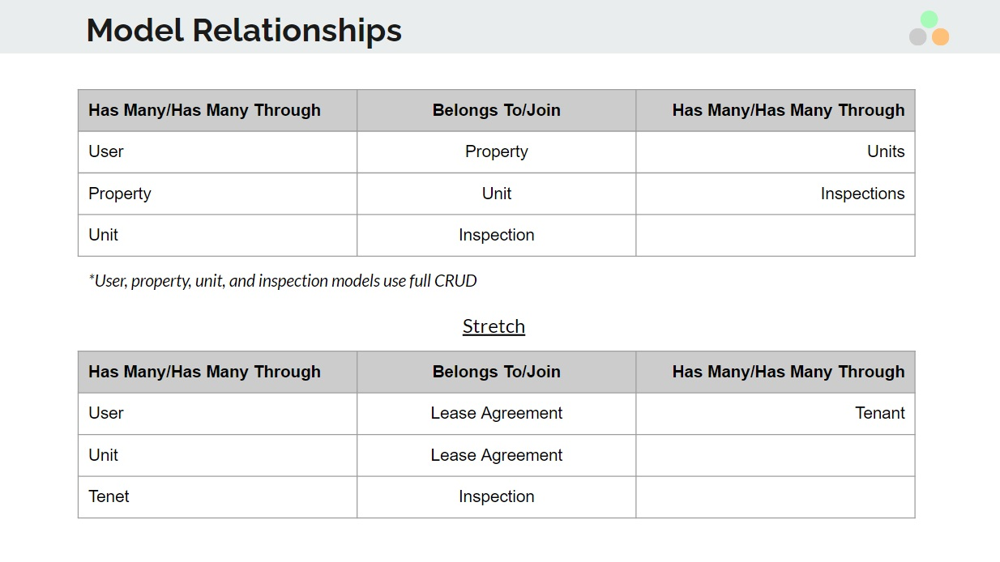

## Welcome to tripleStamp!
"Transforming Real Estate Task Management"

### Model - View - Controller

MODEL (Full CRUD for all models)
* User
* Property
* Unit
* Inspection

FRONTEND (VIEW)
* React.js: Single page application (SPA)
* Redux: Toolkit for global state management
* RTK Query: for data fetching and caching
* React Router V6: Application routing and rendering
* Formik: controlled forms library
* Bootstrap 5: Custom CSS

BACKEND (CONTROLLER)
* Ruby on Rails: Custom Controller, Models, Serializers, Routes
    * Full CRUD for all models
* Active Record: Model associations and resources
* PostgreSQL database

MODEL RELATIONSHIPS

USER STORIES
* create an account/sign up
* sign in with login credentials
* edit profile
* delete profile
* add a property to their account
* add an unit to a property
* add an inspection to a unit

### CUSTOM UI/UX DESIGN SCREENSHOTS

Landing Page

User Sign up

User Login

Profile Page

Dashboard Main (Welcome Message)

Inspections View List Open

Inspections View List Closed

Dashboard Details (Property)

Dropdown Menu

Add Inspection Form

